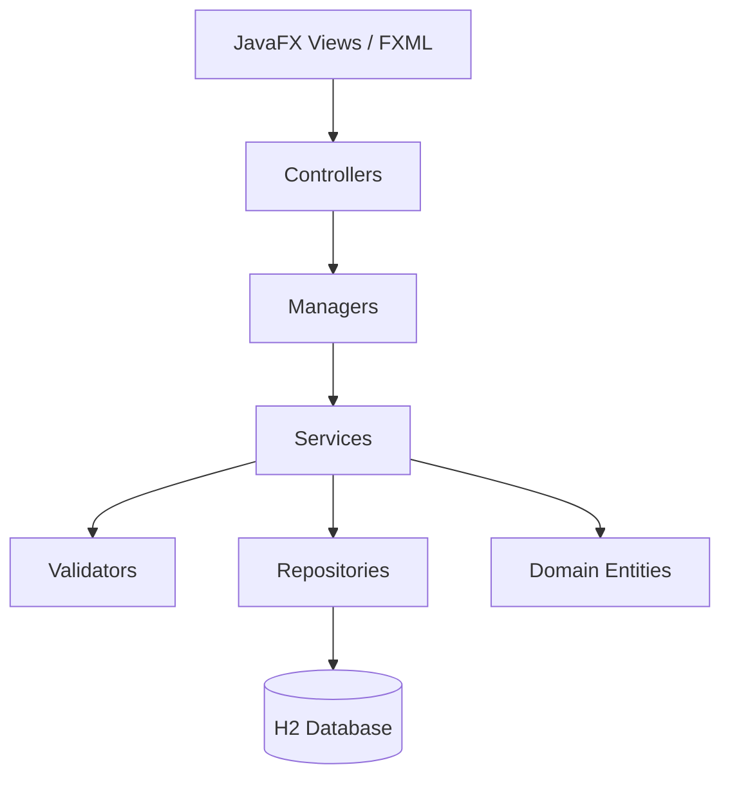

 Backstage Manager

> **A desktop application for planning, operating, and analyzing concerts from a single management platform.**

Backstage Manager was built as an academic software engineering solution for the course **Fundamentals of Software Development** at **Pontificia Universidad Javeriana**. The project addresses a real operational problem in live music production: concert information is often fragmented across spreadsheets, messages, contracts, financial documents, and inventory records. This system centralizes those workflows in a JavaFX desktop application supported by an H2 database and a layered software architecture.

The result is a functional concert management system that connects event planning, artist and contract management, staff assignment, technical inventory, ticketing, finances, security, auditability, and executive reporting.

---

## Table of Contents

- [Project Vision](#project-vision)
- [Academic Context](#academic-context)
- [What the System Does](#what-the-system-does)
- [Core Features](#core-features)
- [Technology Stack](#technology-stack)
- [Architecture](#architecture)
- [Project Structure](#project-structure)
- [How to Run the Project](#how-to-run-the-project)
- [Database Setup](#database-setup)
- [Running Tests](#running-tests)
- [Quality and Development Metrics](#quality-and-development-metrics)
- [Development Methodology](#development-methodology)
- [Contributors](#contributors)
- [Future Work](#future-work)
- [License](#license)

---

## Project Vision

Organizing a concert involves much more than creating an event date. A production team needs to coordinate artists, contracts, staff, technical equipment, schedules, payroll, ticket revenue, expenses, and profitability indicators. When these elements are managed separately, the risk of schedule conflicts, missing information, budget overruns, and poor operational visibility increases.

**Backstage Manager** was designed to reduce that fragmentation.

The application works as a backstage operations center where different modules interact around a common concert workflow:

1. Create and schedule concerts.
2. Manage contracts and technical requirements.
3. Assign staff and operational roles.
4. Register technical inventory and equipment availability.
5. Track ticketing, revenue, expenses, and payroll.
6. Generate management reports for decision-making.
7. Control access through user roles and authentication.

---

## Academic Context

This project was developed as an academic solution for the course:

**Fundamentals of Software Development**  
**Pontificia Universidad Javeriana**  
**Faculty of Engineering**  
**Bogotá, Colombia**

The project was not only focused on delivering a working application, but also on applying software engineering practices such as:

- Layered architecture.
- Separation of responsibilities.
- Object-oriented design.
- Database persistence.
- Version control with Git and GitHub.
- Agile planning using Scrum principles.
- Sprint-based development.
- Code reviews through pull requests.
- Automated testing with JUnit.
- Code coverage measurement with JaCoCo.

---

## What the System Does

Backstage Manager is a **Java desktop application** that supports the planning and administrative control of concerts. It provides a structured interface for teams that need to manage the operational, technical, and financial dimensions of live music events.

The system is useful for scenarios such as:

- Registering concerts and their schedules.
- Managing artists, contracts, and clauses.
- Assigning staff members to concerts.
- Controlling technical inventory and maintenance.
- Calculating ticket revenue and event profitability.
- Managing expenses, income, payroll, and budgets.
- Reviewing activity logs and user actions.
- Generating executive dashboards and reports.

---

## Core Features

### Concert Planning

Create, list, approve, and manage concerts with associated schedules, capacity, contracts, financial analysis, and assigned resources.

### Artist and Contract Management

Manage contracts, clauses, signature status, and concert-related contractual information.

### Staff and Human Resources

Assign users to concerts, manage staff roles and subroles, consult staff directories, and generate payroll information.

### Inventory and Logistics

Register equipment, object types, references, inventory records, technical resources, and maintenance workflows.

### Finance and Profitability

Track budgets, ticketing, revenue, expenses, payroll impact, and profitability analysis for each concert.

### Security and User Roles

Support user authentication, encrypted credentials through BCrypt, session management, role assignment, and access control.

### Audit and Activity Tracking

Register relevant user actions such as login, logout, pending reviews, and operational activity inside the system.

### Management Reports

Generate executive indicators and dashboards to support administrative analysis of concerts, revenue, costs, and operational performance.

---

## Technology Stack

| Layer | Technology |
|---|---|
| Language | Java 21 |
| UI Framework | JavaFX 21 |
| View Definition | FXML |
| Database | H2 Database Engine |
| Build Tool | Apache Maven |
| Testing | JUnit 5 |
| Coverage | JaCoCo |
| Security | BCrypt password hashing |
| Version Control | Git / GitHub |
| Project Management | Jira / Scrum |

---

## Architecture

Backstage Manager follows a **layered architecture** designed to keep the user interface, business rules, validation logic, persistence, and domain model separated.



### Main Layers

#### Presentation Layer — `controller`

JavaFX controllers receive user interactions from FXML views and delegate operations to the application services. This avoids placing business rules directly inside the UI.

#### Orchestration Layer — `manager`

Managers coordinate global application behavior:

- `SceneManager`: handles navigation between screens and controller dependency injection.
- `SesionManager`: stores the active authenticated user state.
- `ContextManager`: centralizes service and repository instances.

#### Business Layer — `service`

Services contain the core use cases of the system, such as concert creation, staff assignment, authentication, financial analysis, payroll, inventory management, and report generation.

#### Validation Layer — `validator`

Validators enforce domain rules before data is persisted or processed. Examples include concert schedule validation and time-range validation.

#### Persistence Layer — `repository`

Repositories abstract SQL access and expose CRUD operations and specialized queries to the service layer.

#### Domain Layer — `entity`

Entities represent the main business concepts of the system, including users, roles, concerts, contracts, schedules, income, expenses, payroll, inventory objects, and reports.

#### Infrastructure Layer — `db`

The H2 infrastructure initializes the local database, executes SQL scripts, and exposes the database connection used by repositories.

---

## Project Structure

```text
backstage-manager/
├── pom.xml
├── mvnw
├── mvnw.cmd
├── data/
│   └── eventosdb.mv.db
├── src/
│   ├── main/
│   │   ├── java/
│   │   │   ├── module-info.java
│   │   │   └── org/example/ax0006/
│   │   │       ├── controller/
│   │   │       ├── db/
│   │   │       ├── dto/
│   │   │       ├── entity/
│   │   │       ├── manager/
│   │   │       ├── repository/
│   │   │       ├── service/
│   │   │       └── validator/
│   │   └── resources/
│   │       ├── SQL/
│   │       │   ├── schema.sql
│   │       │   └── datos.sql
│   │       └── org/example/ax0006/
│   │           ├── *.fxml
│   │           └── css/
│   └── test/
│       └── java/org/example/ax0006/
│           ├── entity/
│           ├── manager/
│           └── service/
└── target/
```

---

## How to Run the Project

### 1. Prerequisites

Install the following tools:

- **Java Development Kit 21**.
- **Maven 3.9+**, or use the included Maven wrapper.
- A desktop environment capable of running JavaFX applications.

Verify Java:

```bash
java --version
```

Expected major version:

```text
java 21
```

---

### 2. Clone or Open the Project

```bash
git clone <repository-url>
cd backstage-manager
```

If you received the project as a ZIP file:

```bash
unzip backstage-manager.zip
cd backstage-manager
```

---

### 3. Run with Maven Wrapper

On macOS or Linux:

```bash
./mvnw clean javafx:run
```

On Windows:

```powershell
mvnw.cmd clean javafx:run
```

---

### 4. Run with Local Maven Installation

```bash
mvn clean javafx:run
```

The configured JavaFX entry point is:

```text
org.example.gestorconciertos/org.example.ax0006.controller.StartController
```

When the application starts, it initializes the H2 database, loads the SQL schema, attempts to load sample data, opens the JavaFX login screen, and starts the H2 web console.

---

## Database Setup

Backstage Manager uses a local H2 database located under the project `data/` directory.

### JDBC Connection

```text
JDBC URL: jdbc:h2:./data/eventosdb
User: sa
Password: <empty>
```

The application initializes the database automatically using:

```text
src/main/resources/SQL/schema.sql
```

Sample or seed data is loaded from:

```text
src/main/resources/SQL/datos.sql
```

### H2 Web Console

When the application starts, the H2 web console is exposed at:

```text
http://localhost:8082
```

Use the JDBC connection values above to inspect the database.

---

## Running Tests

Run the complete automated test suite:

```bash
./mvnw test
```

Or with a local Maven installation:

```bash
mvn test
```

Generate the JaCoCo coverage report:

```bash
./mvnw clean verify
```

Coverage output is generated under:

```text
target/site/jacoco/
```

The test suite includes service-level and domain tests for modules such as:

- Authentication.
- User sessions.
- Concert management.
- Staff assignment.
- Inventory.
- Contracts.
- Ticketing.
- Income and expenses.
- Financial analysis.
- Payroll.
- Reports.
- Role management.
- Activity tracking.

---

## Quality and Development Metrics

During development, the team used GitHub activity, pull requests, and test coverage as technical indicators of project health.

Reported project metrics include:

- More than **300 commits** across the development cycle.
- More than **40,000 lines of code** in the codebase.
- More than **40 pull requests** reviewed and integrated.
- Automated tests with reported coverage above **95%**.
- Three sprint iterations covering planning, implementation, integration, and final validation.

These metrics reflect the academic objective of treating the project as a real collaborative software engineering effort rather than as a single isolated programming assignment.

---

## Development Methodology

The team followed Scrum-inspired practices:

1. **Sprint 1 — Planning and Architecture**  
   Scope definition, backlog organization, use case analysis, architecture design, and initial database modeling.

2. **Sprint 2 — Core Development**  
   Implementation of primary modules, repositories, services, controllers, and JavaFX views.

3. **Sprint 3 — Integration and Validation**  
   Module integration, bug fixing, final testing, report generation, code review, and delivery preparation.

The development process used:

- Jira for backlog and task tracking.
- GitHub for version control.
- Branch-based development.
- Pull requests for integration.
- Code review before merging.
- CODEOWNERS and review rules for governance.

---

## Contributors

Backstage Manager was developed by students from Pontificia Universidad Javeriana as part of an academic software development project.

| Contributor | Main Role / Area |
|---|---|
| **Andres** | Project Director/Manager; high-level product vision and structural decisions |
| **Martin Sanmiguel** | Scrum Master and general coordination; interfaces; reports |
| **Andres Santiago** | Database design and persistence support |
| **Julián** | Database design and persistence support |
| **Diego** | Database design and persistence support |
| **Esteban Correa** | Interface design and JavaFX implementation |
| **Juan Diego** | Interface support; management reports and metrics |
| **All team members** | Java development, functional testing, integration, and validation |

Additional GitHub author aliases observed in the repository history include:

- `Martin`
- `Andres`
- `santiago0217`
- `MandoD1`
- `Andres Cortés`
- `Juan Diego`
- `Jsantiagoleon`
- `Esteban-correa-hub`
- `4stagon`
- `Julian Leon`

---

## Future Work

The current version proves the viability of a centralized concert management desktop platform. Future iterations could extend the project into a production-grade system through:

- Migration from desktop architecture to a web platform.
- Multi-user access from different devices.
- Backend development with Spring Boot.
- Frontend development with React, Angular, or another web framework.
- Cloud deployment using AWS, Azure, or a similar provider.
- Role-specific dashboards for producers, financial managers, technical staff, and administrators.
- Real-time notifications for scheduling conflicts, pending approvals, and inventory availability.
- Exportable reports in PDF or Excel format.
- Stronger CI/CD pipelines and automated release packaging.

---

## Known Notes

- The project uses a local H2 database, so data persistence depends on the local `data/` directory.
- The application starts the H2 web console on port `8082`. If that port is already in use, the console may not start, but the desktop application can still continue.
- The project has an academic scope. Some production concerns, such as cloud deployment, distributed authentication, and multi-tenant access, are candidates for future development.

---
